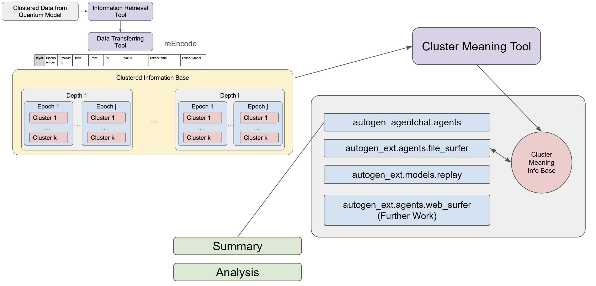

# Quantum-BlockChain-AutoAIAgents-Framework

This repository provides a workflow to analyze **quantum-model-clustered data** by re-encoding and parsing it with various **tools**. After that, an **Auto AI Agents** system—consisting of modules such as:
- `autogen_agentchat.agents`
- `autogen_ext.agents.file_surfer`
- `autogen_ext.models.replay`
- `autogen_ext.agents.web_surfer` (and future work)

—performs autonomous analysis and exploration of each cluster or across multiple clusters.

Below is the system framework diagram.

**Execution Flow and Output Files Table** 

| **Step** | **Script Name** | **Output Directory** | **Example Output File** | **Content & Meaning** |
|----------|---------------|----------------------|-------------------------|-----------------------|
| **1. Re-encoding (Optional)** | `reEncode.py` | Root Directory | `data_encoded.csv` | Re-encodes `Hash`, `From`, and `To` to reduce LLM token load. | 
| | | | `encoding_map.json` | Stores the mapping of original values to encoded IDs, e.g., `H0`, `F1`, `T2`. |
| **2. Converting to Depth/Epoch** | `dataTransferringAgent.py` | `output_csv/` | `Depth_1_Epoch_1.csv` | Splits `data.csv` based on `(Depth, Epoch)`. | 
| | | | `Depth_2_Epoch_3.csv` | Each file represents transactions for a specific `(Depth, Epoch)`. |
| **3. Further Clustering by Cluster** | `toClustered.py` | `clustered_csv/` | `Depth_1_Epoch_1_Cluster_0.csv` | Further splits transactions based on `Cluster_Value`. | 
| | | | `Depth_2_Epoch_3_Cluster_1.csv` | Each file contains transactions for a specific `(Depth, Epoch, Cluster)`. |
| **4. Generating Individual Cluster Summaries** | `clusterSummary.py` | `clusterSummary/` | `summary_Depth_1_Epoch_1_Cluster_0.txt` | LLM-generated description of transaction characteristics within the `Cluster`. | 
| | | | `summary_Depth_2_Epoch_3_Cluster_1.txt` | Analyzes the transaction patterns within the `Cluster`. |
| **5. Comparing Clusters within the Same Depth & Epoch** | `clusterChecker.py` | `clusterAnalysis/` | `analysis_Depth_1_Epoch_1.txt` | LLM comparison of all `Clusters` within the same `Epoch`. | 
| | | | `analysis_Depth_2_Epoch_3.txt` | Identifies why transactions were grouped into separate `Clusters` and their differences. |
| **6. Generating Epoch Summary (Comparing Epochs within the Same Depth)** | `epochComparison.py` | `epochSummary/` | `summary_Depth_1.txt` | LLM comparison of **different `Epochs` within the same `Depth`**. | 
| | | | `summary_Depth_2.txt` | Identifies trends and changes between `Epochs`. |
| **7. Generating Depth Summary (Comparing Across Depths)** | `depthComparison.py` | `depthComparison/` | `final_summary.txt` | LLM comparison of **different `Depths`** in transaction patterns. | 

## 1. Overview

1. **Clustered Data from Quantum Model**  
   - Data is clustered by a quantum-based model. This output is the starting point.  
2. **Information Retrieval Tool**  
   - Takes the quantum-model-clustered data and performs any necessary initial retrieval or shaping of the data.  
3. **Data Transferring Tool**  
   - Passes the retrieved data along through the pipeline, ensuring proper formatting and structure.  
4. **reEncode**  
   - The data is re-encoded for consistency and further analysis.  
5. **Clustered Information Base**  
   - Holds the re-encoded data in “Depth” and “Epoch” structures (e.g., Depth 1..i, each depth having multiple epochs, each epoch containing `k` clusters).  
6. **Cluster Meaning Tool**  
   - Consumes the “Clustered Information Base” to interpret meaning of each cluster. Maintains a separate “Cluster Meaning Info Base” for these interpretations.  
7. **Auto AI Agents**  
   - A set of autonomous AI agents capable of using the provided cluster data (and associated meaning) to further *summarize*, *analyze*, *explore*, and *perform tasks* with respect to each cluster.  
   - Four key modules (with potential for more in the future) currently handle different capabilities:  
     1. `autogen_agentchat.agents`  
     2. `autogen_ext.agents.file_surfer`  
     3. `autogen_ext.models.replay`  
     4. `autogen_ext.agents.web_surfer` (further work)  

The system can be configured to produce final **summaries** and **analyses** that incorporate the processed cluster data and the knowledge gleaned from the “Cluster Meaning Info Base.”  

---

## 2. Architecture Walkthrough

### 2.1 Data Flow

1. **Quantum Model Output**  
   The quantum model clusters raw input data into grouped segments (or clusters).  
2. **Information Retrieval → Data Transferring → reEncode**  
   The pipeline refines, standardizes, and re-encodes the data to ensure it is structured for easy ingestion by the rest of the system.  
3. **Clustered Information Base**  
   - Organized by *Depth* and *Epoch*, each of which can contain multiple clusters.  
   - Each *Depth i* can have *Epoch 1..j*, and *Epoch j* can contain *Cluster 1..k*.  
4. **Auto AI Agents**  
   - The re-encoded clusters are handed off to specialized AI agents that can use, explore, or revise them further.  
   - These AI agents dynamically utilize external or internal tools, and maintain internal state between inferences if required.  
5. **Cluster Meaning Tool & Info Base**  
   - As AI agents analyze clusters, meanings/interpretations are updated in the “Cluster Meaning Info Base.”  
   - This Info Base is also used by the AI system to handle future queries or expansions.

### 2.2 Agents and Their Purposes

A high-level summary of the four agent-related modules follows. For each, note that they can be used either in a standalone fashion or as sub-components of a broader “team”:

#### 2.2.1 `autogen_agentchat.agents`
This module initializes various pre-defined conversational AI agents. It provides classes such as:

- **`AssistantAgent`**  
  A tool-using agent that accepts user messages, can call tools if needed, and returns textual responses. Notable points:  
  - Maintains state across calls to `on_messages()` or `on_messages_stream()`.  
  - Can optionally “reflect” on tool usage before responding.  
  - Provides a convenient interface for hooking in new *tool calls* or *handoffs* to other agents.

- **`BaseChatAgent`**  
  The base class from which all chat agents are derived. It outlines the fundamental methods needed to process a batch of new messages and provide responses.

- **`CodeExecutorAgent`**  
  An agent that detects code blocks in incoming messages (e.g., Python or shell scripts), executes them in an isolated environment (Docker recommended), and returns the execution results.

- **`SocietyOfMindAgent`**  
  Organizes an *inner team* of agents to generate responses. It runs these internal agents in a team setting, collects all their messages, and then synthesizes a final response with an LLM. Often used for more complex multi-step reasoning among multiple sub-agents.

- **`UserProxyAgent`**  
  Represents a human user in an automated environment. It exposes an `input_func` for interactive or asynchronous responses (e.g., waiting on actual user input).

#### 2.2.2 `autogen_ext.agents.file_surfer`
- **`FileSurfer`**  
  An agent specialized in reading or previewing local files. It can open, read, and navigate the file hierarchy. For example, you might want an LLM to locate certain pieces of code or documentation on your local filesystem.

#### 2.2.3 `autogen_ext.models.replay`
- **`ReplayChatCompletionClient`**  
  A mock or “replay” client that replays a series of predefined responses. Useful for testing or for re-running a conversation exactly as before. Supports both single-response completions and streaming.  
  - Can help in simulating user or system responses in a predictable manner.  
  - Has the ability to *reset*, allowing repeated runs of the same conversation for validation or QA.

#### 2.2.4 `autogen_ext.agents.web_surfer` (Further Work)
- **`MultimodalWebSurfer`**  
  An agent with browser-based capabilities (via Playwright).  
  - It can search, open pages, and interact with elements on a webpage.  
  - Requires a multi-modal LLM that can support tool calls, such as GPT-4.  
  - Useful for automating certain browsing tasks or collecting data from websites.

Each of these modules can be composed into a “team” to solve tasks jointly. For instance, a pipeline might have an `AssistantAgent` that delegates local-file searching tasks to `FileSurfer`, or code execution tasks to `CodeExecutorAgent`, etc.

---

## 3. Installation and Requirements

1. **Clone or Download** this repository.  
2. **Install** the relevant Python packages as needed.  
3. Ensure you have a **compatible Python environment** (usually 3.9+ is recommended).  

---

## 4. Usage Example

A general outline of how one might integrate the system:

1. **Quantum-Model Output**  
   Prepare or load your quantum-model-clustered data.  
2. **Initialize Tools**  
3. **Create Teams**  
   Combine multiple agents in a group or orchestrate them individually, depending on your task.  
4. **Parse Clusters**  
   Use the “Clustered Information Base” to feed each cluster’s data to your agents.  
5. **Cluster Meaning**  
   Have your agents reason about the cluster meanings, producing new knowledge in the “Cluster Meaning Info Base.”  
6. **Generate Final Summaries or Analyses**  
   Collate the agent-based results as final text output or structured data.

---

## 5. Extending the System

You can extend the system in several ways:

- **Add more Tools**  
  Implement new Python callables or specialized classes. Register them with your `AssistantAgent` instance.  
- **Create new Agents**  
  Subclass `BaseChatAgent` to create domain-specific or specialized behavior.  
- **Incorporate Additional Data**  
  Integrate more pipelines in the “Data Transferring Tool” phase to enrich the “Clustered Information Base.”

---

## 6. Detailed API References

Below are brief highlights of key classes. For detailed docstrings, see the source code:

### `autogen_agentchat.agents`
- **`AssistantAgent`**  
  - **Usage**: `agent.on_messages(messages, cancellation_token)` returns a `Response`.
  - **Tools**: Agent can call any registered tool if the model predicts a function call.

- **`BaseChatAgent`**  
  - **Usage**: An abstract base, requiring overrides of `on_messages()`, `on_messages_stream()`, and `on_reset()`.

- **`CodeExecutorAgent`**  
  - **Usage**: Automatically executes code snippets found in text messages.

- **`SocietyOfMindAgent`**  
  - **Usage**: Runs an internal team of agents. Collects all of their messages and uses an LLM to produce a final summary response.

- **`UserProxyAgent`**  
  - **Usage**: Hooks an actual user into the chain, collecting real user input asynchronously or via a standard input function.

### `autogen_ext.agents.file_surfer`
- **`FileSurfer`**  
  - A local file-browsing agent. It can open directories/files, read content, and handle queries about local file data.

### `autogen_ext.models.replay`
- **`ReplayChatCompletionClient`**  
  - Mocks an LLM by replaying predefined completions. Useful for testing or demonstration.

### `autogen_ext.agents.web_surfer`
- **`MultimodalWebSurfer`** (Work in progress)  
  - Browser automation via Playwright.  
  - Interacts with websites, can simulate clicks, fill forms, scroll, etc.  
  - Designed to operate with a multi-modal LLM that calls its “tools.”

---

## 7. Contributing

1. **Fork or Branch** to add features or fix issues.  
2. **Pull Requests** are welcome—please include a clear description and any relevant tests.  
3. **Issues**—submit bug reports or enhancement requests in the repository’s issue tracker.

---

## 8. License

The licensing terms for this repository should be clarified in a `LICENSE` file. Please ensure you adhere to any applicable licenses for the quantum model, libraries, or dependencies used here.

---

## 9. Contact

For questions or further details:
- Create an issue on this repository, or
- Contact the maintainers (if contact info is provided).

Thank you for using **Quantum Cluster Analysis** with **Auto AI Agents**! We hope this system makes it easier to analyze, interpret, and derive value from your quantum-model-clustered data. Enjoy exploring your clusters!
